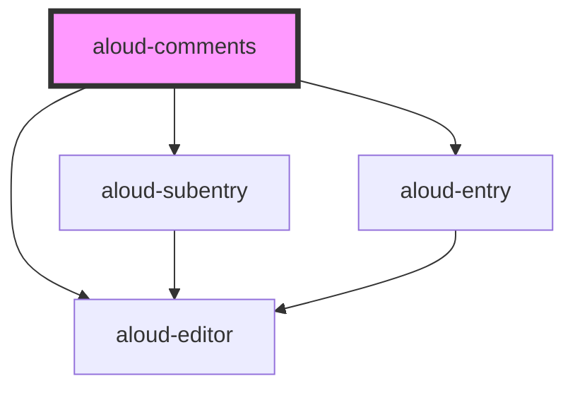

# aloud-comments

<!-- Auto Generated Below -->

## Properties

| Property                | Attribute  | Description                                                                                                        | Type                                                                                    | Default     |
| ----------------------- | ---------- | ------------------------------------------------------------------------------------------------------------------ | --------------------------------------------------------------------------------------- | ----------- |
| `_api`                  | `api`      | API configuration. Will be `yaml.safeLoad()`  Requires either string version in HTML or Object version in JSX      | `string`                                                                                | `undefined` |
| `_firebase`             | `firebase` | Firebase configuration. Will be `yaml.safeLoad()`  Requires either string version in HTML or Object version in JSX | `string`                                                                                | `undefined` |
| `api` _(required)_      | --         | API configuration                                                                                                  | `{ axios: AxiosInstance; init: string; post: string; update: string; delete: string; }` | `undefined` |
| `debug`                 | `debug`    |                                                                                                                    | `boolean`                                                                               | `false`     |
| `firebase` _(required)_ | --         | Firebase configuration                                                                                             | `{ [k: string]: unknown; }`                                                             | `undefined` |

## Dependencies

### Depends on

- aloud-subentry
- aloud-entry
- aloud-editor

### Graph

----------------------------------------------

*Built with [StencilJS](https://stenciljs.com/)*
